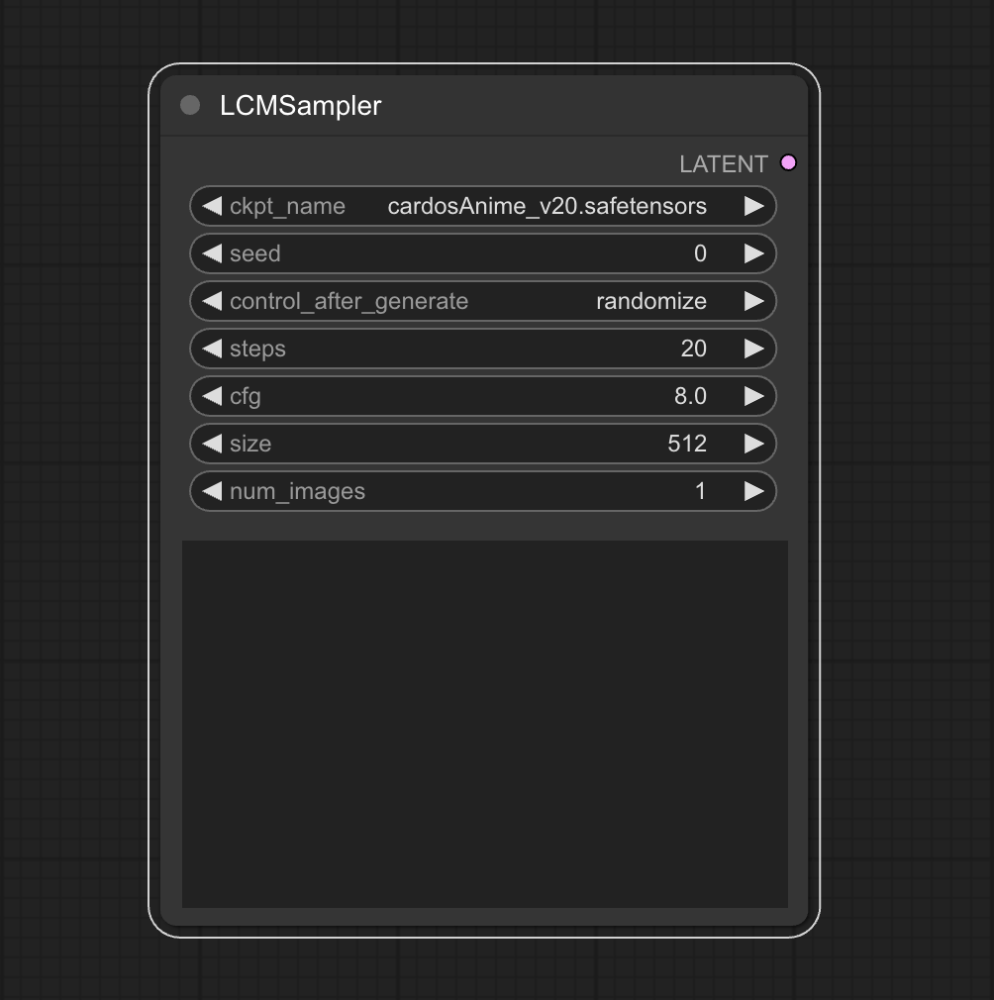

# comfyui-flowty-lcm
This is a comfyui early testing node for LCM, adapted from https://github.com/0xbitches/sd-webui-lcm

It uses the diffusers backend unfortunately and not comfy's model loading mechanism. But the intention here is just to be able to execute lcm inside comfy.

*You need to use a special lcm model for this - the only available checkpoint currently is [LCM_Dreamshaper_v7](https://huggingface.co/SimianLuo/LCM_Dreamshaper_v7).*

